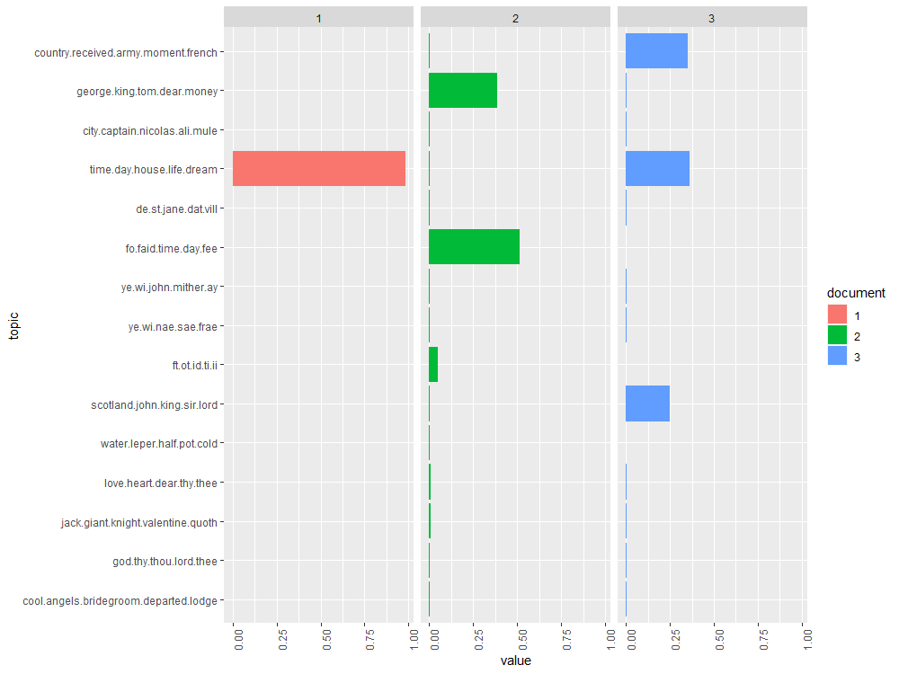
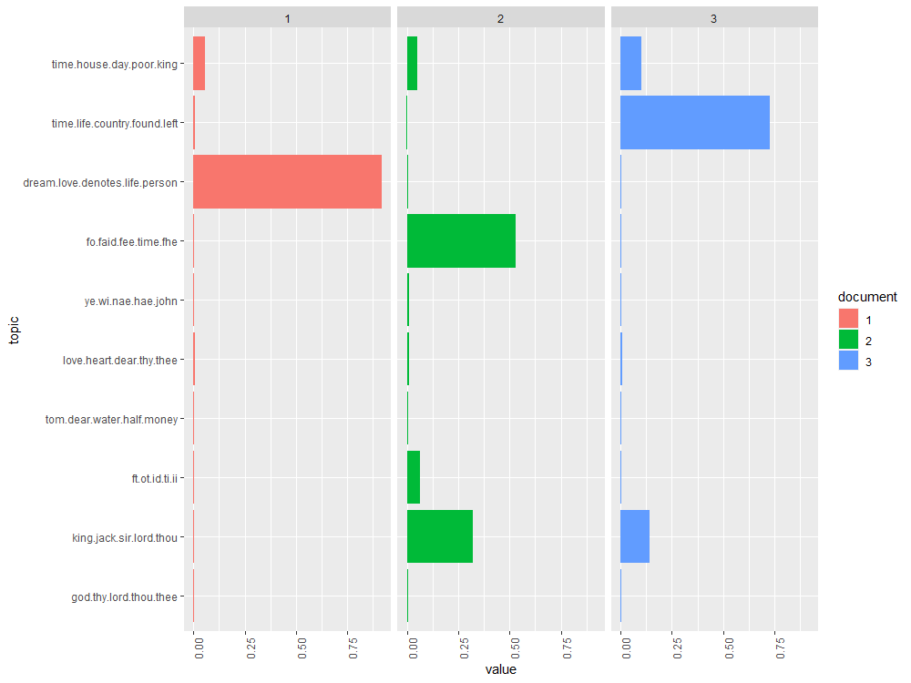
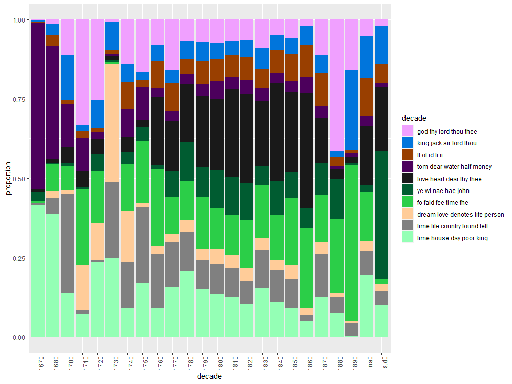

# Evidence for Week Four

## Topic Models

I need to do a little more practice with the Topic Model tool. I understand the outcome in the sense that you can look at the frequency of the topics appearance, but I need to practice a bit more in being able to determine what the topics might mean in order for this to be beneficial. Nevertheless, I managed to follow through with the tutorial and I created a pie chart for some of my results.

## Topic Models in RStudio

### 15 topics

### 10 topics

### 20 topics

