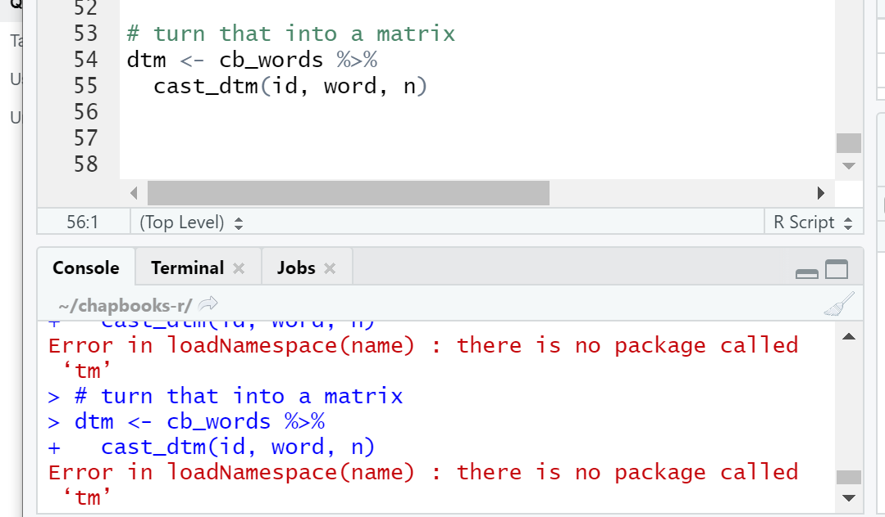

# Reflection for Week Four

Oh, so this is how this class is going to be. Every week I feel like I am getting a little bit closer to understanding, and then the new week comes and it throws me off. This week I went through each exercise twice and went back to catch up on the material from previous week to make sure I understand the purpose of the work I am doing. It's still a work in progress, but I was somewhat successful!

One thing I am proud of this week is how far I've come in being able to solve some errors I run into with different tools. While trying to do the topic models in RStudio I kept getting errors saying things were not installed. A couple weeks ago this would have sent me straight to the discord to ask for help immediately. But as I have become more comfortable with the tools I figured I could try to solve it on my own first. I tried to install the packages it told me were missing and ultimately I was able to get the program unning. I have used R programs before but this just goes to show that the more familiar you become with the tools, the better work you will be able to accomplish.

One thing that I think can get lost in historical argumentation through digital history is the emotion. TTim Hitchcock said that digital history is about more than words on a page. Digital history includes sounds, objects, and space, he continued. I think it is important to remember that these histories that we look at exist in a larger context than the medium they are taken in. It is important to remember that these histories were people's real lives. As a new digital historian, it is easy to get bogged down in the words. Primarily for me, using AntConc was difficult to extract meaning from the words rather than just the words themselves. I am confident that this will come with further exploration of the tools but with keeping in mind the greater context of these histories. 

I feel one of the most important aspects of digital history is what Hitchcock said about studying new things. Digital technologies open up a world full of possibilities. They can be better used when we identify new things to study rather than imposing new methods on older studies.

What digital history can do for us is make this transition between the microscope and macroscope much more efficient. It is much easier to click back and forth between two links when you think you have found an argument rather than reresearch everything. This means that there may be an opportunity with digital history for new arguments and analysis just simply becasue of the ease of use. 

But what is especially important to remember is what Matthew Lincoln describes as confabulation. When doing digital history work it is crucial that you note what you think your arguments are along the early stages of your work. As Lincoln shows, it is very easy to draw a conclusion from a completed work, but if the work is done incorrectly, that seemingy logical conclusion will be inaccurate.
