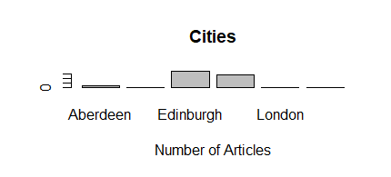
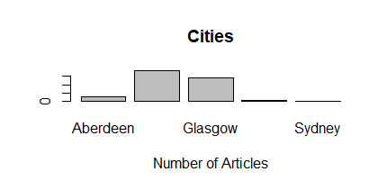
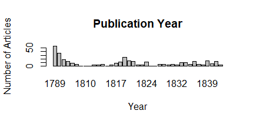
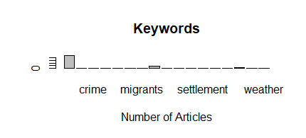

# Notes for Week Four

I completed the first table using RStudio

There was one spelling mistake with "Edinburgh" written as "Edinbugh". To fix this, I downloaded the cvs file, uploaded it to Open Refine, clustered Edinbugh with Edinburgh, put this file into my Github repository, and curled this URL into RStudio to create a new plot.

I then plotted the years.

Next I tried a bit of my own experimentation. I opened the cvs file in Open Refine again. I spet a significant amount of time looking at the keywords. I sifted through all the options and clustered them how I see fit (exerting agency as per Week 3 readings). I then plotted the number of articles by keyword to find that a significant amount of the letters were talking about Native American Peoples.

