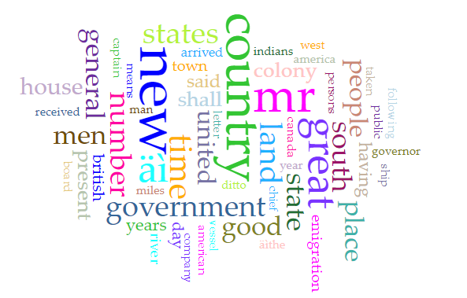
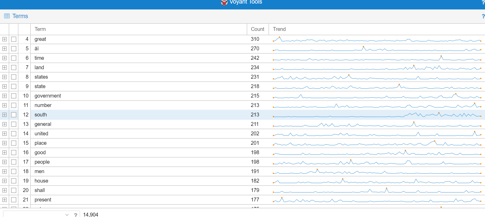
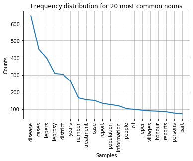

# Notes for Week Four

I completed the first table using RStudio

There was one spelling mistake with "Edinburgh" written as "Edinbugh". To fix this, I downloaded the cvs file, uploaded it to Open Refine, clustered Edinbugh with Edinburgh, put this file into my Github repository, and curled this URL into RStudio to create a new plot. https://raw.githubusercontent.com/rachelnadia/week-four/master/newspaper1.csv

I then plotted the years.

Next I tried a bit of my own experimentation. I opened the cvs file in Open Refine again. I spet a significant amount of time looking at the keywords. I sifted through all the options and clustered them how I see fit (exerting agency as per Week 3 readings). I then plotted the number of articles by keyword to find that a significant amount of the letters were talking about Native American Peoples.

### Voyant

Based on the word images in Voyant, it suggests that the British may have been trying to consolidate their colonies into making them like the British.

The term "south" appears way more frequently in the later articles. This could suggest that after the period of colonization, the hierarchy of believed superiority of government became more apparent.

At this point I am still working on building my own corpus to examine in Voyant.

## AntConc

While I understand the basics on AntConc I found it a little difficult to use. I feel like the most useful aspect - or at least the most interesting one to me - of this tool is comparing it to a more general metafile. I would have liked to do this but I was unsure of what to use for that file and where to find such a thing.

## Jupyter

I followed along with the tutorial in Jupyter with much ease. I thought the tool was very easy to use and quite efficient.

## Reading Notes

- digital reading involves more than jsut words on a page

- includes sounds, objects, space

- how do we identify new things to study rather than imposing new methods on older studies?

- combining the text and non-text

- gives context to the history

- close and distant reading = microscope and macroscope

- making the past available for 'scientific purposes'

- Remember: we don't already know the results of the work
